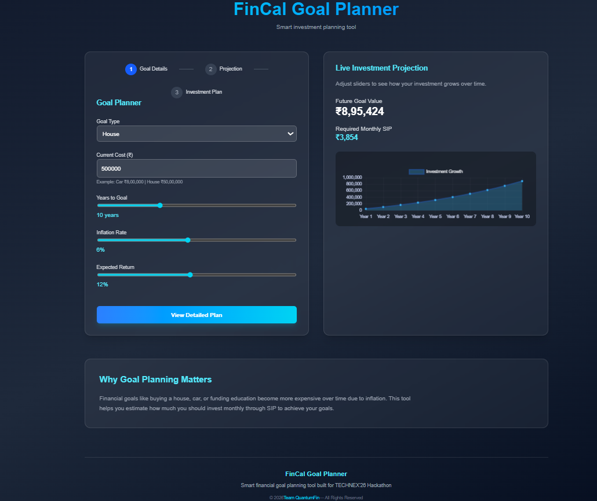
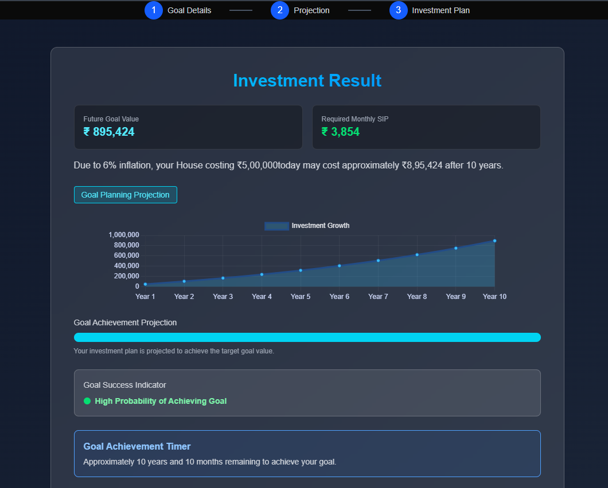
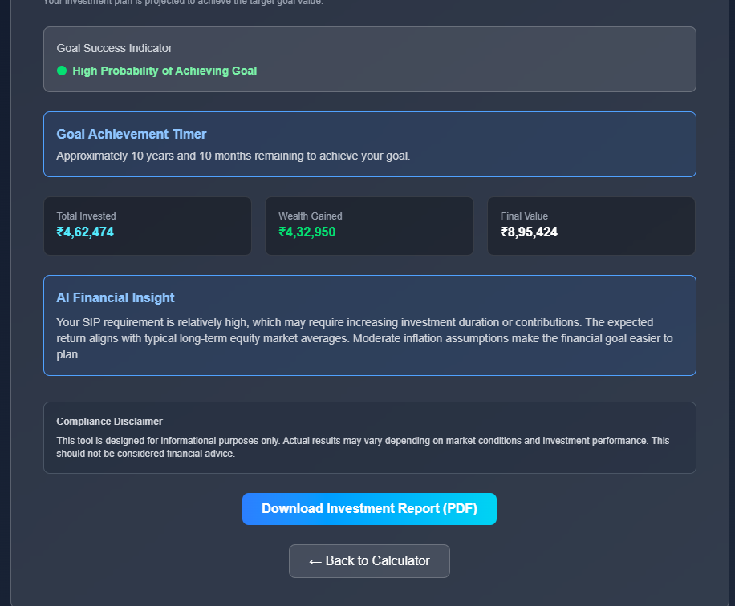

#  FinCal – Smart Goal Based Investment Planner

 **FinCal** is a modern **FinTech web application** that helps users plan their future financial goals through intelligent SIP investment planning.

Users can calculate the **monthly investment required to achieve a financial goal**, visualize **investment growth**, and generate a **downloadable financial report**.

Built using **Next.js 14, React, TypeScript, TailwindCSS, and Chart.js**, FinCal provides a fast, responsive, and intuitive financial planning experience.

---

# 🌐 Live Demo

🔗 **Deployed on Vercel**
https://your-vercel-link.vercel.app

---

#  Problem Statement

Many people struggle with financial planning because they cannot easily estimate:

• How much to invest monthly
• The effect of inflation on future goals
• How investments grow over time

FinCal solves this by providing a **goal-based financial planning calculator** with real-time investment projections.

---

#  Key Features

### 📊 Goal Based Investment Planning

Users can calculate the **SIP required to achieve a future financial goal**.

### 📈 Investment Growth Visualization

Interactive charts show **how investments grow over time**.

### 📉 Inflation Adjustment

The system accounts for **inflation impact on future costs**.

###  AI-Like Financial Insights

FinCal generates smart insights to guide better investment decisions.

### 📄 Downloadable Investment Report

Users can export their investment results as a **PDF report**.

###  Fully Responsive UI

Optimized for **desktop, tablet, and mobile devices**.

###  Fast Performance

Powered by **Next.js App Router for optimized rendering and performance**.

---

# 🛠 Tech Stack

| Technology    | Purpose           |
| ------------- | ----------------- |
| Next.js 14    | React Framework   |
| React         | Frontend UI       |
| TypeScript    | Type Safety       |
| Tailwind CSS  | Styling           |
| Chart.js      | Investment Graph  |
| jsPDF         | Report Generation |
| React CountUp | Animated Numbers  |
| Vercel        | Deployment        |

---

# 🏗 Project Structure

```
app/
 ├ page.tsx
 ├ layout.tsx
 ├ result/
 │   ├ page.tsx
 │   ├ ResultPageContent.tsx
 │
components/
 ├ Calculator.tsx
 ├ ResultChart.tsx
 ├ StepIndicator.tsx
 ├ TeamModal.tsx

public/
 ├ assets
```

---

#  How It Works

1️⃣ User enters financial goal details
2️⃣ FinCal calculates future goal value considering inflation
3️⃣ SIP required to reach the goal is computed
4️⃣ Investment growth is visualized using charts
5️⃣ User can download the financial report

---

#  Example Calculation

Goal: Buy a Car
Current Cost: ₹10,00,000
Inflation: 6%
Years: 10

Future Cost: **₹17,90,000**

Required SIP (12% return): **₹8,000/month**

---

#  Installation & Setup

Clone the repository

```bash
git clone https://github.com/yourusername/fincal_goal_planner.git
```

Move into the project folder

```bash
cd fincal_goal_planner
```

Install dependencies

```bash
npm install
```

Run development server

```bash
npm run dev
```

Open in browser

```
http://localhost:3000
```

---

#  Screenshots

### Calculator



### Investment Result Page



### Reports and Insights



---

#  Future Improvements

• AI powered investment recommendations
• Goal success probability analysis
• Portfolio diversification suggestions
• Real-time market return data integration
• User login & investment tracking

---

#  Team

**Team QuantumFin**

• Shivam Sony – Frontend Development & Implementation
• Shantanu Kumar – Financial Research & Strategy
• Priyanshu Kumar - UI/UX Design Support

---

#  Hackathon Project

This project was built as part of a **FinTech Hackathon** to demonstrate how technology can simplify personal financial planning.


---

#  Support

If you like this project, consider giving it a ⭐ on GitHub!
